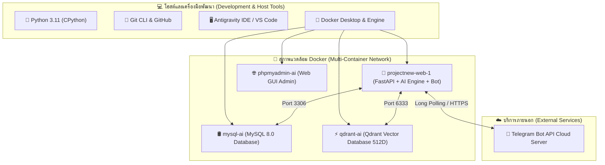

# 📦 รายการไฟล์และโปรแกรม/เทคโนโลยีทั้งหมดในโปรเจกต์ (Project Files & Tech Stack Inventory)
## โครงการ: Warrant & AI Recognition Direct Bot (`projectnew`)

เอกสารนี้รวบรวมและแจกแจงรายการ **นามสกุลไฟล์ (File Extensions)**, **ไฟล์ทั้งหมดในโปรเจกต์**, **โปรแกรม (Software/Tools)**, และ **ไลบรารีปัญญาประดิษฐ์ (AI/Libraries)** ที่ใช้งานในระบบทั้งหมดอย่างละเอียด

---

## 📊 1. ตารางสรุปภาพรวมนามสกุลไฟล์ (File Extensions Summary)

| นามสกุลไฟล์ | ประเภท / หน้าที่ | จำนวนไฟล์ | ขนาดโดยประมาณ | ตัวอย่างไฟล์สำคัญ |
| :--- | :--- | :---: | :---: | :--- |
| **`.py`** | ซอร์สโค้ดภาษา Python (FastAPI, AI Core, Bot, DB, Modules) | 59 ไฟล์ | ~190 KB | `app/main.py`, `run_polling.py`, `app/core/classifier.py` |
| **`.jpg` / `.jpeg`** | ไฟล์รูปภาพใบหน้าคนร้าย, ป้ายทะเบียน, และบัตรประชาชนทดสอบ | 244 ไฟล์ | ~43.0 MB | `datatest/FACE/...`, `datatest/CAR/...` |
| **`.png`** | ไฟล์รูปภาพไอคอน, ภาพตัวอย่าง และหลักฐานตรวจจับ | 12 ไฟล์ | ~2.4 MB | รูปประกอบใน `flie/` และ `uploads/` |
| **`.jfif`** | ไฟล์รูปภาพฟอร์แมต JFIF สำหรับทดสอบการตรวจจับ | 2 ไฟล์ | ~10 KB | ภาพทดสอบในชุดข้อมูล `datatest/` |
| **`.pt`** | โมเดล PyTorch Deep Learning Weights (YOLOv8) | 1 ไฟล์ | ~6.25 MB | `yolov8n.pt` (ใช้ตีกรอบป้ายทะเบียน Fast-ALPR) |
| **`.txt`** | ไฟล์ตั้งค่า Dependency และไฟล์ Label ข้อมูล | 26 ไฟล์ | ~10 KB | `requirements.txt`, Label ข้อมูลในชุดทดสอบ |
| **`.md`** | เอกสารคู่มือ, สรุปโครงการ, และ Operational Runbook | 6 ไฟล์ | ~80 KB | `README.md`, `PROJECT_SUMMARY.md`, `SKILL.md` |
| **`.sql`** | โครงสร้างฐานข้อมูล DDL Schema & Mock Data | 1 ไฟล์ | ~4 KB | `init.sql` / ตารางฐานข้อมูล `Face_Ai` |
| **`.env` / `.example`** | ไฟล์เก็บความลับระบบ Environment Variables | 2 ไฟล์ | ~1 KB | `.env`, `.env.example` |
| **`.dockerignore`** | กำหนดรายการไฟล์ที่ไม่ต้องคัดลอกลง Docker Image | 1 ไฟล์ | ~120 B | `.dockerignore` |
| **`Dockerfile`** | สคริปต์สร้าง Linux Python 3.11 Container Image | 1 ไฟล์ | ~720 B | `Dockerfile` |
| **`.yml` / `.yaml`** | ไฟล์คอนฟิก Docker Compose Multi-Container Orchestration | 1 ไฟล์ | ~1.1 KB | `docker-compose.yml` |
| **`.gitignore`** | กำหนดรายการไฟล์ที่ยกเว้นไม่ให้อัปโหลดขึ้น Git (PDPA) | 1 ไฟล์ | ~300 B | `.gitignore` |
| **`.pdf`** | เอกสารรายงานผลการพัฒนาและสรุปโครงการฉบับสมบูรณ์ | 1 ไฟล์ | ~88 KB | `flie/system_development_summary.pdf` |
| **`.pyc`** | ไฟล์ไบนารีแคชไพธอนคอมไพล์ (Python Bytecode) | 76 ไฟล์ | ~440 KB | แคชในโฟลเดอร์ `__pycache__/` |

---

## 🛠️ 2. โปรแกรม ระบบปฏิบัติการ และซอฟต์แวร์ที่ใช้งาน (Software & Systems Used)



### 1. 🐍 ภาษาโปรแกรมและรันไทม์ (Runtime & Language):
* **Python 3.11:** รันไทม์หลักสำหรับทั้ง Backend API, AI Algorithms, และ Telegram Bot
* **Linux (Debian 12 Bookworm):** ระบบปฏิบัติการฐานภายใน Docker Container (`python:3.11-slim`)

### 2. 🐳 ระบบจัดการคอนเทนเนอร์ (Containerization):
* **Docker Desktop / Docker Engine:** รันและควบคุม Container ทั้งหมด
* **Docker Compose:** จัดการเชื่อมต่อ 4 Services พร้อมกันบน Internal Network:
  1. **`projectnew-web-1` (Web & AI):** รัน FastAPI Server, AI Pipeline, และ Telegram Polling
  2. **`mysql-ai`:** ระบบฐานข้อมูลเชิงสัมพันธ์ MySQL 8.0 (พอร์ต `3306`)
  3. **`qdrant-ai`:** ฐานข้อมูลเวกเตอร์ Qdrant สำหรับค้นหาใบหน้า 512 มิติ (พอร์ต `6333`, `6334`)
  4. **`phpmyadmin-ai`:** เว็บ UI สำหรับจัดการฐานข้อมูล MySQL (พอร์ต `8080`)

### 3. 🐙 ระบบควบคุมเวอร์ชัน (Version Control):
* **Git CLI:** บันทึกและควบคุมประวัติการพัฒนา (Commit History, Branching, Staging)
* **GitHub:** Remote Repository สำหรับจัดเก็บและแชร์ซอร์สโค้ด (`NKNon0/warrant-face-recognition`)

### 4. 🛢️ ระบบฐานข้อมูล (Databases):
* **MySQL 8.0 Server:** จัดเก็บข้อมูลโครงสร้าง (ตาราง `face_profiles`, `license_plates`, `warrants`, `users`, `media_requests`, `search_results`)
* **Qdrant Vector Database (v1.19.0):** จัดเก็บเวกเตอร์ 512D ArcFace พร้อมดัชนี HNSW (Hierarchical Navigable Small World)
* **phpMyAdmin:** เครื่องมือ Web UI จัดการฐานข้อมูลผ่านเบราว์เซอร์

### 5. 🤖 แพลตฟอร์มบอทและการสื่อสาร (Bot Platform):
* **Telegram Bot API:** สื่อสารแบบ Direct Chat ผ่าน Bot `@Nontdanu_bot` (Long Polling & Webhooks)
* **BotFather:** เครื่องมือสร้างบอทและกำหนดสิทธิ์ใน Telegram

---

## 🧠 3. ไลบรารี Python และ AI Frameworks ที่ใช้งาน (Python Libraries & AI Stack)

### 1. 🚀 เว็บเฟรมเวิร์กและระบบ Asynchronous (Web & Networking):
* **`fastapi` (v0.141.x):** เว็บเฟรมเวิร์กความเร็วสูงแบบ ASGI
* **`uvicorn[standard]` (v0.52.x):** ASGI Web Server ประสิทธิภาพสูง
* **`aiohttp` (v3.14.x):** Asynchronous HTTP Client สำหรับดาวน์โหลดรูปภาพและ Polling จาก Telegram
* **`aiomysql` (v0.3.x):** Async MySQL Driver พร้อมระบบ Connection Pool (20 ช่อง)
* **`pydantic` (v2.13.x):** ระบบ Data Validation และ Type Schema
* **`python-dotenv` (v1.2.x):** โหลดการตั้งค่าจากไฟล์ `.env` เข้าสู่ระบบ
* **`python-multipart`:** รองรับการอัปโหลดไฟล์รูปภาพผ่าน Form-Data

### 2. 👤 โมดูลตรวจจับและค้นหาใบหน้า (Face Recognition):
* **`insightface` (v1.0.1):** สถาปัตยกรรม Deep Metric Learning (โมเดล **ResNet50 / ArcFace `buffalo_l`**) สกัดเวกเตอร์ 512 มิติ
* **`onnxruntime` (v1.28.x):** เอนจินรัน Deep Neural Network ONNX บน CPU Execution Provider
* **`qdrant-client` (v1.19.0):** ไคลเอ็นต์เชื่อมต่อ Qdrant Vector Database เพื่อทำ Cosine Similarity

### 3. 🚗 โมดูลตรวจจับและอ่านป้ายทะเบียนรถ (License Plate ALPR):
* **`ultralytics` (v8.4.x):** โมเดล **YOLOv8 CNN Object Detection (`yolov8n.pt`)** ตีกรอบเจาะเฉพาะป้ายทะเบียน
* **`paddlepaddle` & `paddleocr`:** อัลกอริทึม Deep OCR (CRNN + CTC Loss) อ่านภาษาไทยและตัวเลขแบบ Fast Mode (`cls=False`)
* **`pytesseract`:** ไคลเอ็นต์เชื่อมต่อ Tesseract OCR Engine ภาษาไทยและอังกฤษ
* **`opencv-python-headless` (v5.0.x / `cv2`):** ประมวลผลภาพ Computer Vision:
  * 4-Point Perspective Transform (ดัดภาพเอียงเป็นแนวตรง)
  * Laplacian Unsharp Masking (เพิ่มความคมชัดของขอบตัวอักษร)
  * CLAHE & Grayscale Binarization

### 4. 🪪 โมดูลตรวจจับและอ่านบัตรประชาชน (Thai ID Card):
* **`opencv-python-headless`:** ฟิลเตอร์ **Morphological Top-Hat & Black-Hat Filter** ขับเน้นตัวหนังสือที่ซีดจางหรือสะท้อนแสงแฟลช
* **Modulo 11 Checksum Algorithm (Python Core):** คำนวณตรวจสอบความถูกต้องของเลขบัตรประชาชน 13 หลัก
* **Regex Engine (`re`):** สกัดคำนำหน้า (นาย/นาง/นางสาว) และชื่อ-สกุลภาษาไทย

### 5. 📦 ไลบรารีคณิตศาสตร์และการจัดการข้อมูล (Math & Data Processing):
* **`numpy` (v2.x):** ประมวลผลเมทริกซ์, อาเรย์รูปภาพ, และคำนวณ Normalized Vector Cosine Distance
* **`pillow` (`PIL` v12.x):** อ่านและแปลงฟอร์แมตไฟล์ภาพ (JPEG, PNG, JFIF)
* **`cryptography` (v50.x):** ระบบเข้ารหัสความปลอดภัยสำหรับการเชื่อมต่อฐานข้อมูล MySQL

---

## 📁 4. แผนผังจำแนกไฟล์สำคัญในโปรเจกต์ (Project Directory File Mapping)

```
projectnew/
├── 📄 .env                         # ไฟล์เก็บรหัสผ่านจริงและ Token (ความลับ ห้ามอัปขึ้น Git)
├── 📄 .env.example                 # ตัวอย่างไฟล์คอนฟิก Environment
├── 📄 .gitignore                   # รายการไฟล์ที่ยกเว้นไม่ให้อัปขึ้น Git (PDPA & Scratch)
├── 📄 .dockerignore                # รายการไฟล์ที่ยกเว้นในการ Build Docker
├── 🐳 Dockerfile                   # คำสั่งสร้าง Container Python 3.11 + Tesseract Thai
├── 🐳 docker-compose.yml           # คำสั่งผูก 4 Services (Web, MySQL, Qdrant, phpMyAdmin)
├── 📦 requirements.txt             # รายการ Python Libraries ทั้งหมด
├── 🧠 yolov8n.pt                   # โมเดลน้ำหนัก PyTorch YOLOv8 สำหรับตรวจจับป้ายทะเบียน
├── 🔄 run_polling.py               # สคริปต์รัน Telegram Polling Mode แบบ Standalone
├── 📘 README.md                    # คู่มือภาพรวมโครงการ
├── 📑 PROJECT_SUMMARY.md           # สรุปโครงการฉบับสมบูรณ์ (ทฤษฎี, สถาปัตยกรรม, ขั้นตอนพัฒนา)
├── 📦 PROJECT_FILES_AND_TOOLS.md   # [ไฟล์นี้] สรุปไฟล์และโปรแกรมทั้งหมดในโปรเจกต์
│
├── 📂 app/                         # โฟลเดอร์ซอร์สโค้ดหลัก (Clean Modular Architecture)
│   ├── config.py                   # ค่าคงที่และการตั้งค่าระบบ
│   ├── main.py                     # จุดเริ่มต้น FastAPI Server & AI Startup Warmup
│   ├── ai_processor.py             # Facade เชื่อมต่อ AI ทุกตัว (Backward Compatible)
│   ├── telegram_bot.py             # Facade เชื่อมต่อ Telegram Bot (Backward Compatible)
│   │
│   ├── 📂 core/                    # แกนกลางระบบ AI
│   │   ├── classifier.py           # Auto Multi-Modal Classifier (< 100ms)
│   │   └── router.py               # Smart Router & Fallback Cascade
│   │
│   ├── 📂 modules/                 # โมดูล AI 3 ด้านแยกอิสระ
│   │   ├── 📂 face/                # 👤 โมดูลใบหน้า (detector.py, matcher.py)
│   │   ├── 📂 license_plate/       # 🚗 โมดูลป้ายทะเบียน (detector.py, preprocessor.py, ocr_engine.py, matcher.py)
│   │   └── 📂 id_card/             # 🪪 โมดูลบัตรประชาชน (enhancer.py, parser.py, matcher.py)
│   │
│   ├── 📂 db/                      # 🛢️ จัดการฐานข้อมูล (mysql.py, vector_db.py)
│   ├── 📂 bot/                     # 🤖 Telegram Bot Direct Chat (bot_service.py, formatter.py)
│   └── 📂 api/                     # 🌐 REST Endpoints (routes.py)
│
├── 📂 datatest/                    # โฟลเดอร์เก็บชุดข้อมูลทดสอบจริง (ภาพใบหน้า, ทะเบียน, บัตร)
│   ├── 📂 FACE/                    # ภาพถ่ายใบหน้าผู้ต้องหา
│   ├── 📂 CAR/                     # ภาพถ่ายป้ายทะเบียนรถ
│   └── 📂 IDCARD/                  # ภาพถ่ายบัตรประชาชน
│
├── 📂 flie/                        # เอกสารสรุปงานและรายงาน PDF
│   ├── system_development_summary.md
│   └── system_development_summary.pdf
│
├── 📂 scratch/                     # สคริปต์สำหรับทดสอบและเทรนข้อมูล
│   ├── master_train_all_ai.py      # สคริปต์เทรนและซิงค์ข้อมูล AI ทั้งหมดลงฐานข้อมูล
│   ├── test_auto_classifier.py     # สคริปต์ทดสอบการจำแนกประเภทภาพอัตโนมัติ
│   └── verify_all_imports.py       # สคริปต์ตรวจสอบ Import ทั้ง 27 โมดูล
│
└── 📂 .agents/skills/my-skill/     # สกิลและคู่มือปฏิบัติการ AI Agent
    └── SKILL.md                    # Operational Runbook สำหรับบอท
```
