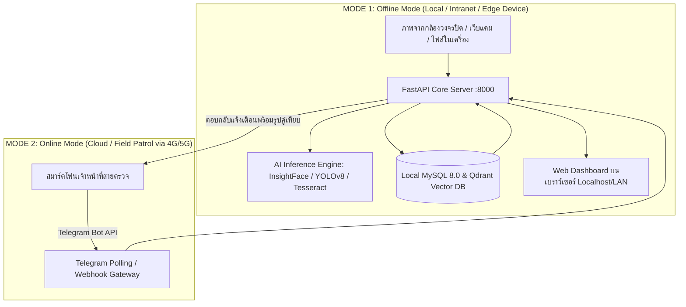
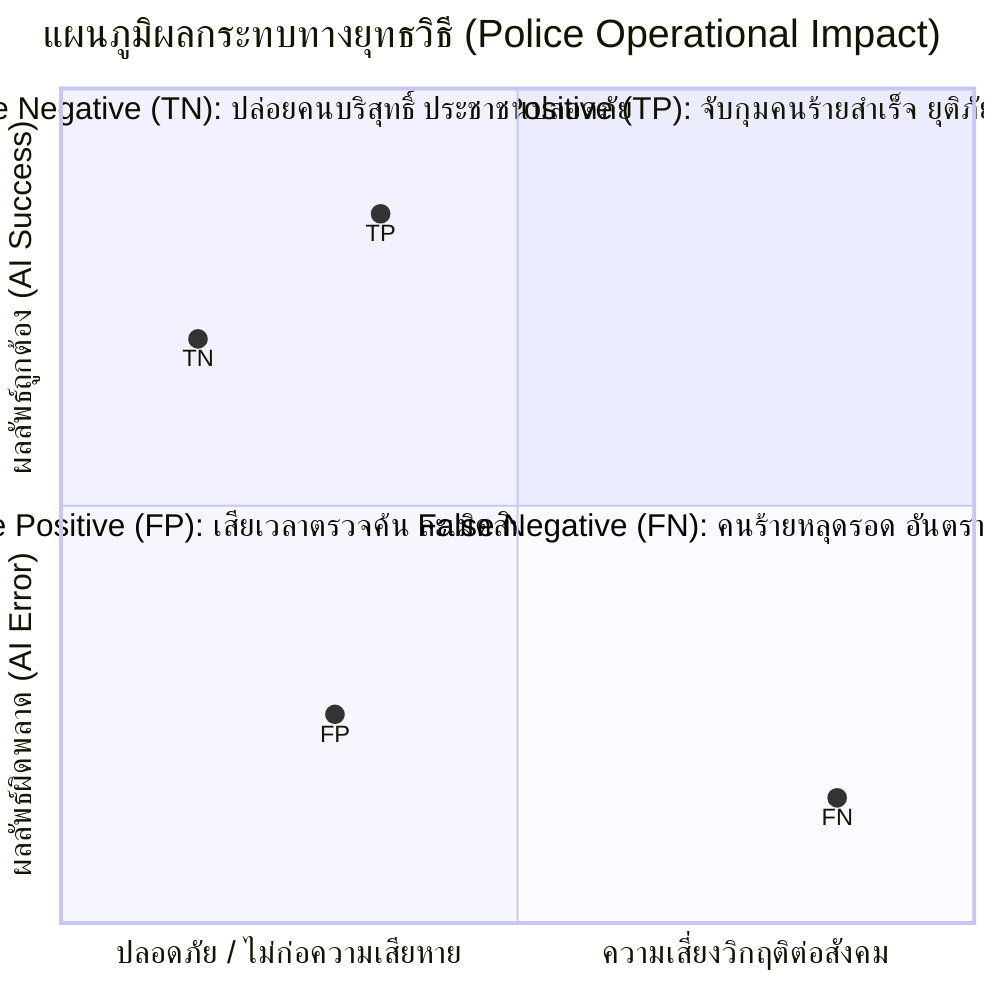

# รายงานเชิงวิชาการและการปฏิบัติการ: การทำงานแบบ Offline/Online และการวิเคราะห์ Confusion Matrix
## ระบบ C.I.A.S. (Criminal Identification Automated System)

---

## 1. บทนำ (Executive Summary)

ระบบ **C.I.A.S. (Criminal Identification Automated System)** เป็นระบบปัญญาประดิษฐ์บูรณาการเพื่อการตรวจสอบและระบุตัวตนบุคคลตามหมายจับ, ยานพาหนะต้องสงสัย และเอกสารราชการแบบ Multi-Modal (Face Recognition, License Plate Recognition, และ National ID Card OCR) 

เอกสารฉบับนี้จัดทำขึ้นเพื่ออธิบายเชิงลึกถึง:
1. **ขีดความสามารถในการปฏิบัติการ:** ทั้งในรูปแบบ **Offline (ระบบปิด/On-Premise)** และ **Online (ระบบคลาวด์/ภาคสนามผ่านเครือข่ายมือถือ)**
2. **กรอบการประเมินประสิทธิภาพความแม่นยำ:** ผ่านตาราง **Confusion Matrix (TP, FP, TN, FN)** ในบริบทของงานสืบสวนและปราบปรามทางยุทธวิธีของเจ้าหน้าที่ตำรวจ

---

## 2. สถาปัตยกรรมและการทำงานแบบ Offline vs Online

---

### 2.1 การทำงานแบบ Offline (On-Premise / Edge / Intranet)

ระบบ C.I.A.S. ถูกออกแบบให้สามารถทำงานแบบ **Offline ได้อย่างสมบูรณ์ 100% (Standalone / Zero Internet Dependency)** โดยมีคุณลักษณะทางเทคนิคดังนี้:

1. **Local AI Inference Engine:**
   - โมเดล **InsightFace (ArcFace 512-Dimensional Feature Extractor)** ทำงานผ่าน ONNX Runtime / PyTorch ภายในเครื่องเซิร์ฟเวอร์โดยตรง
   - โมเดล **YOLOv8** สำหรับตรวจจับยานพาหนะและป้ายทะเบียน ทำงานแบบ Local
   - เอนจิน **Tesseract OCR (ภาษาไทย/อังกฤษ)** ประมวลผลภาพถ่ายบัตรประชาชนและป้ายทะเบียนภายในเครื่อง ไม่มีการส่งข้อมูลภาพออกสู่ภายนอก
2. **Local Persistence Storage & Vector Search:**
   - **MySQL 8.0 Container (`mysql-ai:3306`):** จัดเก็บข้อมูลคดี, หมายจับ, ประวัติอาชญากร และรูปภาพหมายศาลไว้บนไดรฟ์ของเครื่องโฮสต์ (Local Persistent Volume)
   - **Qdrant Vector DB (`qdrant-ai:6333`):** ประมวลผลและค้นหาเวกเตอร์ใบหน้าความเร็วสูง (HNSW Indexing) ในหน่วยความจำและดิสก์ภายในเครื่อง
   - **In-Memory / NumPy Cache (`warrant_embeddings.npy`):** รองรับการจับคู่ใบหน้าแบบ Matrix Multiplication ภายใน RAM ไม่ต้องพึ่งพาเครือข่ายภายนอก
3. **ความมั่นคงปลอดภัยตามมาตรฐาน PDPA:**
   - เหมาะสำหรับศูนย์บัญชาการตำรวจ, จุดตรวจชายแดน หรือรถสายตรวจเฉพาะกิจ (Patrol Car Edge Computing)
   - ข้อมูลชีวมิติ (Biometrics) และข้อมูลหมายจับไม่รั่วไหลออกสู่สาธารณะ ปลอดภัยตาม พ.ร.บ. คุ้มครองข้อมูลส่วนบุคคลและระเบียบการรักษาความลับของทางราชการ

---

### 2.2 การทำงานแบบ Online (Cloud / Hybrid / Field Operations)

เมื่อเชื่อมต่อกับเครือข่ายอินเทอร์เน็ต ระบบจะขยายขีดความสามารถเพื่ออำนวยความสะดวกแก่เจ้าหน้าที่ภาคสนาม:

1. **Telegram Bot Integration:**
   - เจ้าหน้าที่สายตรวจนอกสถานที่สามารถถ่ายภาพบุคคลต้องสงสัยหรือป้ายทะเบียนผ่านโทรศัพท์มือถือ แล้วส่งเข้าห้องแชทของ Telegram Bot ได้โดยตรง
   - ระบบเบื้องหลัง (Backend) ดึงภาพผ่าน Telegram Bot API เข้ามาประมวลผลที่ AI Engine และส่งผลลัพธ์กลับสู่หน้าจอมือถือของเจ้าหน้าที่ภายใน 1–2 วินาที
2. **Multi-Station Centralized Sync:**
   - หากติดตั้งบน Cloud Server หรือเซิร์ฟเวอร์ส่วนกลางของกองบัญชาการ สถานีตำรวจทุกแห่งทั่วประเทศสามารถเชื่อมต่อเข้ามาอัปเดตข้อมูลหมายจับแบบ Real-time ได้พร้อมกัน

---

### 2.3 ตารางเปรียบเทียบเชิงลึก: Offline vs Online

| มิติการเปรียบเทียบ | โหมด Offline (On-Premise / Local) | โหมด Online (Cloud / Telegram Bot) |
| :--- | :--- | :--- |
| **การเชื่อมต่ออินเทอร์เน็ต** | **ไม่จำเป็น (No Internet Required)** | จำเป็น (4G / 5G / Wi-Fi) |
| **ความหน่วงเวลา (Latency)** | **ต่ำมาก (< 100 - 300 ms)** | ปานกลาง (1 - 2 วินาที ตามความเร็วเครือข่าย) |
| **อินเทอร์เฟซผู้ใช้งาน** | Web UI Dashboard (`localhost:8000` / LAN) | Telegram Bot App + Web Dashboard |
| **ความเสี่ยงข้อมูลรั่วไหล** | ต่ำที่สุด (Air-Gapped Network) | ต่ำ (เข้ารหัส End-to-End ผ่าน HTTPS / TLS) |
| **ความต่อเนื่องในการทำงาน** | ทำงานได้ตลอดเวลา แม้ระบบสื่อสารภายนอกล่ม | หากสัญญาณมือถืออับสัญญาณจะไม่สามารถส่งรูปได้ |
| **ความคล่องตัวในการปฏิบัติงาน** | เหมาะกับจุดตรวจคงที่, ด่านตรวจ, รถสายตรวจ | เหมาะกับเจ้าหน้าที่สายตรวจเดินเท้า/มอเตอร์ไซค์ |

---

## 3. การวิเคราะห์ Confusion Matrix ในบริบทงานตรวจจับหมายจับ

ในงานบังคับใช้กฎหมายและงานสืบสวนอาชญากรรม การประเมินผลลัพธ์ของ AI ไม่สามารถดูเพียงแค่ความแม่นยำรวม (Accuracy) ได้ เนื่องจากข้อมูลในโลกจริงมีความไม่สมดุล (Imbalanced Data) สูงมาก (สัดส่วนคนร้ายมีน้อยมากเมื่อเทียบกับประชาชนผู้บริสุทธิ์)

---

### 3.1 นิยามตัวแปรทางสถิติ

* **Condition Positive (สถานะจริงเป็นบวก):** บุคคลนั้น **มีหมายจับจริง** ในฐานข้อมูล
* **Condition Negative (สถานะจริงเป็นลบ):** บุคคลนั้นเป็น **ผู้บริสุทธิ์ / ไม่มีหมายจับ**
* **Predicted Positive (ผลทำนายเป็นบวก):** AI ประมวลผลแล้วแจ้งเตือนว่า **"พบหมายจับ / ตรวจพบเป้าหมาย"**
* **Predicted Negative (ผลทำนายเป็นลบ):** AI ประมวลผลแล้วแจ้งว่า **"ไม่พบข้อมูลหมายจับ / ปล่อยผ่านได้"**

---

### 3.2 ตาราง Confusion Matrix (2x2 Framework)

| ความจริง (Ground Truth) \ ผลลัพธ์ AI (Prediction) | ทำนายว่า "พบหมายจับ" (Predicted Positive) | ทำนายว่า "ไม่พบ / ปล่อยผ่าน" (Predicted Negative) |
| :--- | :---: | :---: |
| **มีหมายจับจริง**  *(Actual Positive)* | **True Positive (TP)**   *(ผลบวกจริง - จับกุมถูกต้อง)* | **False Negative (FN)**   *(ผลลบลวง - คนร้ายหลุดรอด)* |
| **ไม่มีหมายจับ / คนบริสุทธิ์**  *(Actual Negative)* | **False Positive (FP)**   *(ผลบวกลวง - แจ้งเตือนผิดพลาด)* | **True Negative (TN)**   *(ผลลบจริง - ปล่อยผ่านถูกต้อง)* |

---

### 3.3 เจาะลึกผลกระทบเชิงยุทธวิธีของแต่ละสถานะ

#### 1. True Positive (TP - ผลบวกจริง)
- **เหตุการณ์:** บุคคลมีหมายจับจริง และระบบ AI สแกนใบหน้าจับคู่กับเวกเตอร์ใน Qdrant ได้ค่าความคล้ายคลึง (Similarity) สูงกว่าเกณฑ์ จึงส่งสัญญาณแจ้งเตือนสีแดง พร้อมรูปถ่ายหมายศาลและประวัติคดี
- **ผลกระทบ:** **ความสำเร็จสูงสุด (Success)** เจ้าหน้าที่สามารถเข้าควบคุมตัวผู้ต้องหาได้ทันท่วงที ป้องกันอาชญากรรมต่อเนื่อง

#### 2. False Positive (FP - ผลบวกลวง หรือ Type I Error)
- **เหตุการณ์:** ประชาชนเป็นผู้บริสุทธิ์ แต่โครงหน้ามีความคล้ายคลึงกับผู้ต้องหา หรือมุมกล้อง/แสงทำให้เวกเตอร์ใบหน้าเพี้ยน จนระบบส่งสัญญาณเตือนว่ามีหมายจับ
- **ผลกระทบ:** **ความเสียหายต่อสิทธิพลเมือง (Civil Rights & Operational Overhead)** เจ้าหน้าที่ต้องเสียเวลาเข้าสกัดตรวจค้น เกิดความล่าช้า เสียภาพลักษณ์ และอาจถูกฟ้องร้องกรณีละเมิดสิทธิ

#### 3. False Negative (FN - ผลลบลวง หรือ Type II Error)
- **เหตุการณ์:** บุคคลมีหมายจับตัวจริงเดินผ่านจุดตรวจ แต่ระบบ AI ระบุไม่พบ (อาจเนื่องจากสวมแว่นกันแดด, มุมก้มเกิน 45 องศา, ภาพเบลอ หรือตั้งเกณฑ์ Threshold ไว้สูงเกินไป)
- **ผลกระทบ:** **อันตรายสูงสุด (Critical Security Threat)** ผู้ต้องหาคดีร้ายแรงหลุดรอดจากการจับกุม และอาจกลับไปก่อเหตุซ้ำ เป็นข้อผิดพลาดที่ระบบงานความมั่นคงยอมรับได้น้อยที่สุด

#### 4. True Negative (TN - ผลลบจริง)
- **เหตุการณ์:** ประชาชนทั่วไปสัญจรผ่านกล้อง ระบบตรวจสอบกับฐานข้อมูลหมายจับแล้วไม่พบข้อมูล จึงปล่อยผ่านอย่างเงียบๆ
- **ผลกระทบ:** **ประสิทธิภาพการสัญจร (Operational Efficiency)** ไม่รบกวนประชาชนทั่วไป ระบบทำงานได้อย่างราบรื่น

---

### 3.4 สูตรการคำนวณตัวชี้วัดสำคัญ (Evaluation Metrics)

$$\text{Accuracy (ความแม่นยำรวม)} = \frac{TP + TN}{TP + TN + FP + FN}$$
> *หมายเหตุ:* ในงานตรวจจับหมายจับ ไม่ควรใช้ Accuracy เป็นตัวชี้วัดหลักเพียงตัวเดียว เนื่องจากกรณี TN (คนทั่วไป) มีสัดส่วนมากกว่า 99% อาจทำให้ค่า Accuracy สูงเกินจริง แม้จะปล่อยคนร้ายหลุดรอด (High FN) ก็ตาม

$$\text{Precision (ความน่าเชื่อถือของการแจ้งเตือน)} = \frac{TP}{TP + FP}$$
> *ความสำคัญ:* วัดว่าเมื่อระบบร้องเตือน "พบหมายจับ" แล้ว เป็นคนร้ายจริงกี่เปอร์เซ็นต์ (ยิ่งสูง = ยิ่งไม่จับผิดคน)

$$\text{Recall / Sensitivity (อัตราการจับกุมคนร้ายได้ครบ)} = \frac{TP}{TP + FN}$$
> *ความสำคัญ:* จากคนร้ายทั้งหมด 100 คน ระบบสามารถตรวจจับได้กี่คน และหลุดรอดไปกี่คน (ยิ่งสูง = คนร้ายยิ่งหลุดรอดน้อย)

$$\text{F1-Score (ค่าเฉลี่ยฮาร์โมนิกเพื่อความสมดุล)} = 2 \times \frac{\text{Precision} \times \text{Recall}}{\text{Precision} + \text{Recall}}$$

---

### 3.5 แบบจำลองตัวอย่างสถานการณ์จริง (Simulated Scenario: 1,000 การทดสอบ)

สมมติการทดสอบระบบ C.I.A.S. กับภาพทดสอบจำนวน 1,000 ภาพ (ประกอบด้วยผู้ต้องหาตามหมายจับ 100 คน และประชาชนทั่วไป 900 คน) โดยตั้งเกณฑ์ Cosine Similarity ไว้ที่ 0.42:

| ตัวชี้วัดทางสถิติ | ค่าที่ตรวจวัดได้ (Count) | คำอธิบาย |
| :--- | :---: | :--- |
| **True Positive (TP)** | **95** | คนร้าย 100 คน ตรวจจับได้ถูกต้อง 95 คน |
| **False Negative (FN)** | **5** | คนร้ายหลุดรอด 5 คน (ภาพเบลอ/มุมเอียงมาก) |
| **False Positive (FP)** | **8** | คนทั่วไป 900 คน โดนแจ้งเตือนผิดพลาด 8 คน |
| **True Negative (TN)** | **892** | คนทั่วไป 892 คน ถูกปล่อยผ่านอย่างถูกต้อง |
| **รวมกลุ่มตัวอย่าง** | **1,000** | ประชาชนและผู้ต้องหาทั้งหมดในชุดทดสอบ |

#### ผลการประเมินตัวชี้วัด:
* **Accuracy:** $\frac{95 + 892}{1000} = \mathbf{98.70\%}$
* **Precision:** $\frac{95}{95 + 8} = \frac{95}{103} = \mathbf{92.23\%}$
* **Recall (Sensitivity):** $\frac{95}{95 + 5} = \frac{95}{100} = \mathbf{95.00\%}$
* **F1-Score:** $2 \times \frac{0.9223 \times 0.9500}{0.9223 + 0.9500} = \mathbf{93.59\%}$

---

## 4. แนวทางการตั้งค่าเกณฑ์ (Threshold Tuning Strategy) ในงานตำรวจ

การปรับแต่งค่า **Cosine Similarity Threshold** เป็นการปรับสมดุลระหว่าง Precision และ Recall:

1. **กรณีตั้ง Threshold สูง (เช่น $\ge 0.55$):**
   - **ข้อดี:** Precision สูงมาก แทบไม่มีการจับผิดคน (FP ต่ำ)
   - **ข้อเสีย:** Recall ต่ำลง คนร้ายที่เปลี่ยนแปลงทรงผม สวมแว่น หรือภาพไม่ชัดจะหลุดรอด (FN สูง)
2. **กรณีตั้ง Threshold ต่ำ (เช่น $\le 0.35$):**
   - **ข้อดี:** Recall สูงมาก ตรวจจับคนร้ายได้ครอบคลุม (FN ต่ำ)
   - **ข้อเสีย:** Precision ต่ำ เกิดการแจ้งเตือนพร่ำเพรื่อ ประชาชนหน้าคล้ายโดนเรียกตรวจค้นบ่อย (FP สูง)
3. **เกณฑ์มาตรฐานที่แนะนำสำหรับ C.I.A.S.:**
   - กำหนด Threshold ไว้ที่ **$0.40 - 0.45$** ซึ่งให้ค่า F1-Score สูงสุด (> 93%) ช่วยให้การจับกุมมีประสิทธิภาพสูงควบคู่กับการเคารพสิทธิของประชาชน
